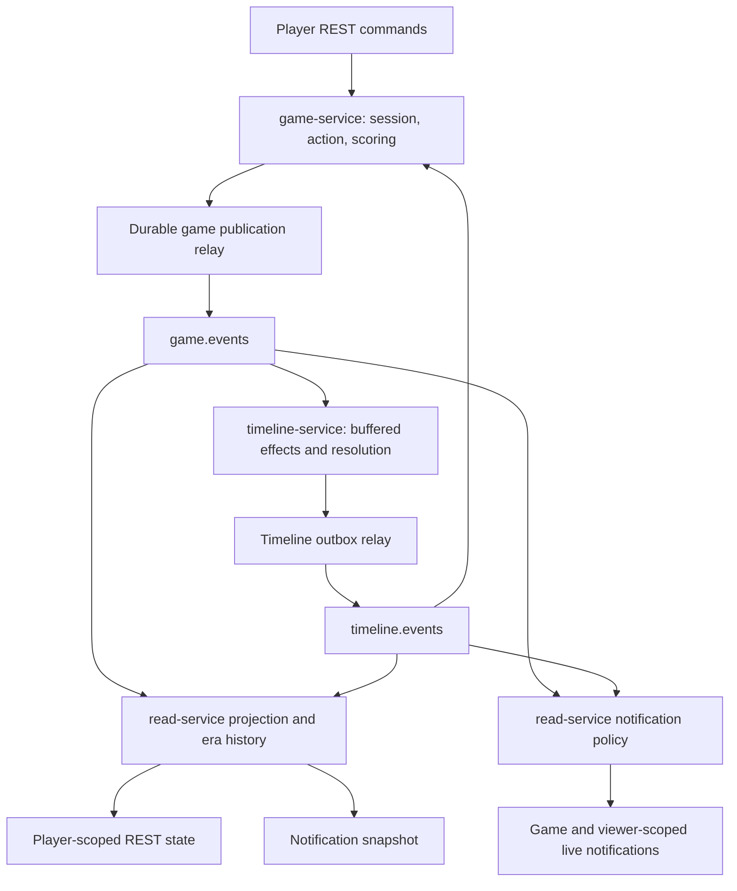
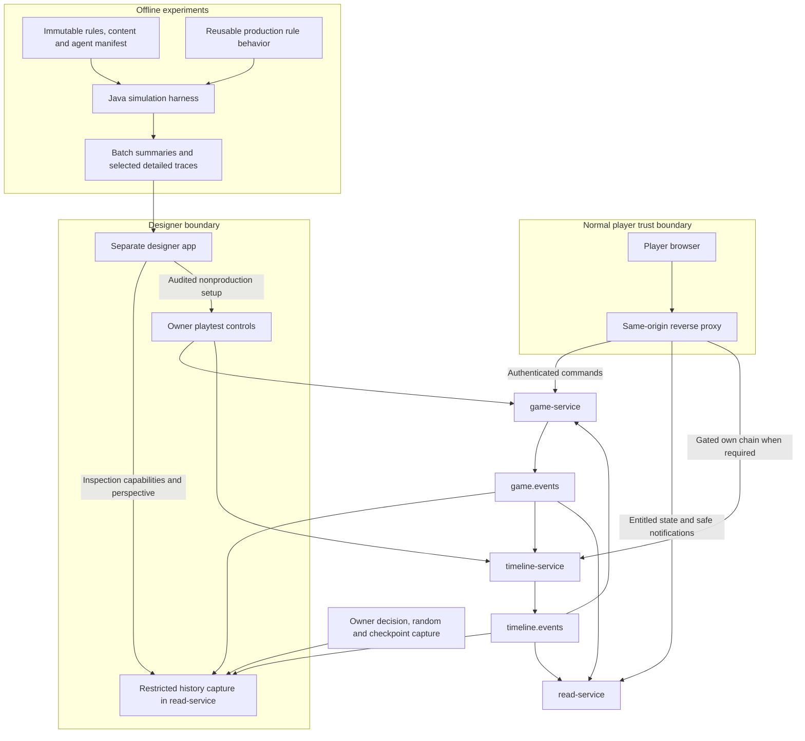

# Temporal Rift: Gameplay Client, Playtesting and Balance System Discovery

## 1. Executive Summary

**Agreed direction:** Build a browser-based, desktop-first player interface using TypeScript, React and Vite, with a 2D DOM/SVG presentation. Use the existing REST command APIs and player-scoped read model, with a same-origin reverse proxy. Extend the read model to recover all information required to continue playing after reconnect. Treat real-time messages as notifications over a recoverable state model, rather than making a browser reconstruct the game from backend integration events.

Build three capabilities with different trust and execution boundaries: normal gameplay, restricted designer inspection, and automated experiments. They can share presentation components and contracts, but should not share access to privileged data. Initially, use separate player and designer application entry points in one frontend repository. Host inspection/history capabilities in the existing read-service deployable, and run simulation as an offline Java harness. A new playtest microservice, analytics microservice, BFF, warehouse, or independent game-engine rewrite is not justified yet.

**Finding:** This is already a substantial playable backend, but not a complete implementation of every intended game mechanic. It has lobby/action APIs, private hands, information-card reveals, durable timers, outcome resolution, score ledgers, an era-history projection, and WebSocket notifications. However:

- Faction identity can currently escape through live score notifications and faction-specific score reasons. Fix the backend disclosure before inviting normal players.
- The REST snapshot does not contain several transient player-visible facts needed after reconnect, including public probability bands and declaration state. Notification snapshots also have a different shape from REST responses.
- Outcome resolution chooses the highest-probability eligible outcome; it does not sample a random winner. Randomness primarily enters through setup, deals, timeout selection, interception, and generated identifiers.
- Whole-game replay does not follow from timeline event sourcing. Session/action/scoring are primarily current-state persistence; the existing history is an era summary, not a complete command, observation, or decision log.
- The inspected timeline producer uses timeline-event 3.0.0 while game-service and read-service consume 2.2.0. The major change removes a band message. Experiments need a verified contract-compatible deployment manifest, not an assumption that sibling checkouts work together.

**Recommendation:** Define balance as viable asymmetric objectives, meaningful decisions and counterplay, acceptable pacing, and understandable outcomes across player counts and faction compositions. Measure faction success conditional on presence, ending mode, experience, and composition. Separate mechanical effects, strategic value, and human enjoyment. Random agents can expose invalid states and unused mechanics; they cannot demonstrate that deception, agency, or social play is enjoyable.

Introduce immutable experiment manifests and ruleset attribution early. Add durable restricted history before serious balance campaigns. Introduce deterministic setup and execution before high-volume simulation. Reuse production rules in an in-process harness with in-memory adapters and virtual time; use a small deployed-system sample to check fidelity and integration behavior.

### Answers to the twenty discovery questions

| Question | Recommended answer |
|---|---|
| 1. How should humans initially play? | Remote browser sessions, one authenticated identity and private view per participant, with invite links, hand selection, three action rounds, resolution, and results. |
| 2. Which technology/form factor? | TypeScript, React and Vite; desktop-first responsive web interface with 2D DOM/SVG rendering, retained across delivery stages. |
| 3. What is meaningful balance? | Competitive viability of asymmetric goals, useful choices and counterplay, pacing, agency, and tolerable setup/order variance, stratified by composition and ending. |
| 4. How should human playtesting work? | Facilitated sessions on an isolated stack; ordinary player views, identified configurations, annotations, and post-game debriefs. Privileged intervention is explicit and recorded. |
| 5. Build automated simulation? | Yes, after establishing a coherent executable ruleset and deterministic inputs; begin with legality/invariant coverage and heuristic comparisons. |
| 6. How should it execute? | In-process Java using the same rule behavior, in-memory ports and virtual time; small public-API/system runs verify integration fidelity. |
| 7. What data is needed? | Game/run manifest, accepted decisions, available opportunities, random decisions, observations, phase boundaries, effects, exact score entries, endings, interventions, and human feedback. |
| 8. What exists already? | Setup/deal facts, accepted submissions, summaries, bands/reveals, outcomes, paradox/chain facts, score changes and endings; these need durable capture and interpretation. |
| 9. Seeded games? | Yes for controlled setup and simulation, with versioned RNG behavior and recorded choices. A seed alone is insufficient. |
| 10. Replay? | Yes for faithful inspection of recorded games; deterministic command re-execution is a separate later capability. |
| 11. Configurable balance parameters? | Extend existing validated properties and driven ports; keep numeric tuning separate from structural rule changes. |
| 12. Versioned rulesets? | Yes: immutable effective configuration, content and engine identity pinned to each game/run. |
| 13. Analytical tooling? | First searchable games, a perspective-aware timeline, score/effect explanations and basic cohort comparisons; then batch/experiment reports. |
| 14. Same player/admin application? | Separate deployable frontend entry points sharing safe components, initially one repository; backend permissions remain independent. |
| 15. Designer privileges? | Controlled setup, accelerated timers, inspection and annotations first; explicit actor-preserving test-seat control in isolated environments; arbitrary mutation and branching later. |
| 16. New backend components? | Restricted history/inspection capability in read-service, narrow setup controls owned by existing services, offline simulation runner; no new service initially. |
| 17. Protect hidden information? | Authenticate, authorize participation and perspective, and construct safe payloads on the backend for REST, notifications, history and exports. |
| 18. Existing architecture changes? | Correct disclosure and contract gaps, complete reconnect state, pin rules/configuration, archive decisions and observations, and make execution dependencies substitutable for simulation. |
| 19. Build first? | A complete, secure three-player browser playtest with a named ruleset, basic recording and debrief; close gaps that invalidate that slice. |
| 20. Defer what? | Native clients, advanced bots, million-game infrastructure, generic configuration platforms, arbitrary live state editing, full production branching and elaborate dashboards. |

## 2. Current-State Findings

### 2.1 Evidence scope and limits

**Current State:** Discovery inspected the local source trees, published-contract source modules, canonical internal design notes, registered baseline specifications, public architecture pages, migrations, configuration and test sources on 15–16 September 2026. The findings below cite repository-visible sources so this document is usable outside the original workspace.

| Repository | Inspected revision/context |
|---|---|
| game-service | `1d2b7a1`, branch `feat/prometheus-metrics-200`, with ongoing observability edits in the working tree. |
| timeline-service | `4ab4130`, main. |
| read-service | `1e26a9f`, main. |
| apis | `eba2ead`, main. |
| infrastructure | Initially `a1b1733`; advanced to `b36e201` during discovery. Configuration was re-read, including the complete scoring map. |
| temporal-rift-bom | `80ab891`, main; Java 26 baseline. |
| docs-site | `d314419`, master, with unrelated untracked image assets. |

**Tradeoff:** This is source-backed discovery, not a deployment certification or measured throughput study. No service tests, container stack, or live multiplayer game were executed. Existing tests show intended verification coverage, not proof that they currently pass. Concurrent changes make these observations a dated snapshot. Source module versions and service dependency pins were read separately; artifact availability and remote branch state were not verified.

For Java references below, paths are relative to these repository roots:

| Label | Concrete source root |
|---|---|
| Game Java | `game-service/src/main/java/io/github/temporalrift/game/` |
| Timeline Java | `timeline-service/src/main/java/io/github/temporalrift/timeline/` |
| Read Java | `read-service/src/main/java/io/github/temporalrift/read/` |

For example, Game Java `session/application/saga/StartGameSagaImpl.java` identifies the full path under the first root. Contract/resource references use complete repository-relative paths.

### 2.2 Deployment, domain ownership and persistence

**Current State:** Three independently deployed services own separate PostgreSQL databases. game-service is a Spring Modulith with session, action, scoring and shared code. timeline-service is a single-context Spring Boot application. read-service is a Spring Modulith with projection, notification and shared code. Current architecture intent is visible in `docs-site/architecture/overview.mdx`, `hexagonal.mdx`, `modulith.mdx`, `cqrs.mdx` and `event-sourcing.mdx`.

| Owner | Authoritative concern | Persistence/evidence |
|---|---|---|
| Game/session | Lobby membership, host, assigned factions, remaining catalog deck, instance-to-catalog mapping, era/cascade counters and ending status. | Game Java `session/domain/lobby/Lobby.java`, `session/domain/game/Game.java`, `session/infrastructure/adapter/out/persistence/GameRepositoryAdapter.java`; current-state rows and persisted saga/inbox state. |
| Game/action | Pending seven-card selections, retained/remaining hands, jam state, submitted actions, special budgets and Activist declarations. | Game Java `action/domain/actionround/ActionRound.java`, `action/domain/playerstate/PlayerState.java`, `action/domain/handselection/HandSelection.java`, `action/domain/activisterastate/ActivistEraState.java`; repositories, round/selection state and histories. |
| Game/scoring | Signed score totals, exact applied deltas, eligibility/correlation facts and end-game awards. | Game Java `scoring/domain/playerscore/PlayerScore.java`, `scoring/application/command/EraScoreEvaluator.java`, `UpdateScoresCommandHandler.java`, `scoring/infrastructure/adapter/out/config/ScoreRulesProperties.java`; current totals and score-history rows. |
| Timeline | Actual outcome weights/flags, stall state, seal-breach state, event resolution, chain streams and paradox-phase orchestration. | Timeline Java `domain/futureevent/FutureEvent.java`, `domain/weaverchain/WeaverChain.java`, `infrastructure/adapter/out/persistence/JpaFutureEventRepository.java`, `JpaWeaverChainRepository.java`; event store plus indexes, buffers, entitlements and saga tables. |
| Read | Denormalized player views, public state, purchased intel, chain summary and era history. | Read Java `projection/domain/model/`, `projection/infrastructure/adapter/in/kafka/ProjectionEventApplier.java`, `GameHistoryEventApplier.java`; projection tables rather than authoritative game rules. |

Each service starts Liquibase from `src/main/resources/db/changelog/db.changelog-master.xml`. There is no single authoritative whole-game row or cross-service database join. A browser must not reconcile contradictory values by inventing domain behavior: command acceptance belongs to the write owner; read state converges asynchronously.

**Finding:** Framework-free domain classes are a real foundation for simulation. Application behavior is not all framework-free: lifecycle, dealing, action correlation, scoring coordination and deadlines live in Spring components and repository-backed workflows. Calling only `FutureEvent` would omit much of the actual game.

### 2.3 Setup and gameplay lifecycle

**Current State:** The normal intended game has three to five players and one distinct hidden faction per player, drawn from Erasers, Prophets, Revisionists, Weavers and Activists. The selected faction roster is public; its mapping to individual players is private.

1. `SessionController.createLobby` derives the host from `CurrentPlayer.id()`. `CreateLobbyCommandHandler` creates separate lobby and preassigned game UUIDs and a join code. Joining accepts a lobby UUID and display name, with identity derived from authentication. Leaving can transfer host or close the lobby.
2. `StartGameSagaImpl.start` locks the lobby, checks host, player count and connectivity, shuffles the faction roster and catalog deck, assigns factions, persists lobby/game state and emits `FactionAssigned`, `FactionsDrawn`, `GameStarted` and `EraStarted`.
3. `EraSagaImpl` draws fresh catalog entries while preserving carried event identities, mints game-specific event/outcome IDs, emits `EventsDrawn` and deals seven private graded cards to each player. Each player selects five; expiry chooses a uniform random five-card subset. `HandSelectionEventListener` waits for all terminal selections before requesting Action Round 1.
4. `ActionRoundSagaImpl` opens three rounds sequentially. A participant submits one card or eligible faction special per round. All-submitted and timer-expired paths race through persisted close handling; absent submissions generate skips. Round summaries expose action family/category, not private targets or specific specials.
5. Timeline buffers ordinary card actions and supported specials, then applies the round at `ActionRoundClosed`. `ReplayRoundActionsCommandHandler` implements priority/correlation behavior: NULLIFY, SEAL, ANNIHILATE, CORRUPT, MIMIC, AMPLIFY and remaining actions. Remaining-tier ordering uses envelope timestamp, then envelope event UUID. Thus the game has simultaneous submission semantics but retains an ordering dependency for some effect combinations.
6. After Round 2, public bands are published. Scan grants player-specific exact-state reveals refreshed at subsequent round closes; Trace and Intercept are observations of a particular past state.
7. Round 3 closure triggers `ResolutionStarted`. `ResolveEraCommandHandler` evaluates post-action events, detects paradoxes, resolves eligible events and reports stalled entries. A paradox phase records one eligible card per player, closes when all submit or its deadline expires, and re-detects affected conditions. Unresolved paradoxes cascade.
8. `EraResolutionCompleted` supplies every event's terminal result in reveal order: `OUTCOME_APPLIED`, `CASCADED`, or `STALLED`. Session uses only cascades for collapse accounting, while both cascaded and stalled events replace fresh draws in the next era. Scoring correlates the completed inputs and emits `ScoresUpdated`.
9. `EraSagaAdvancer` checks score threshold, collapse and era limit. Without an ending it emits the next era. `EndGameSagaImpl` finalizes scores, including the eligible Revisionist bonus, then emits `GameEnded` and `FactionRevealed`.

Evidence: Game Java `session/application/saga/{StartGameSagaImpl,EraSagaImpl,HandSelectionEventListener,EraSagaAdvancer,EndGameSagaImpl}.java`, `action/application/saga/ActionRoundSagaImpl.java`; Timeline Java `infrastructure/adapter/in/kafka/CardPlayedAndResolutionKafkaConsumer.java`, `application/command/{ReplayRoundActionsCommandHandler,ResolveEraCommandHandler}.java`, `application/saga/ParadoxResolutionSagaImpl.java`.

```mermaid
flowchart LR
  Lobby[Authenticated lobby] --> Setup[Distinct hidden factions and shuffled deck]
  Setup --> Deal[Era: reveal events and deal seven]
  Deal --> Keep[Players keep five or timeout selection]
  Keep --> R1[Round 1]
  R1 --> R2[Round 2]
  R2 --> Bands[Public bands and private purchased intel]
  Bands --> R3[Round 3]
  R3 --> Resolve[Resolve and detect paradoxes]
  Resolve --> Phase[Paradox phase when needed]
  Resolve --> Barrier[Ordered terminal results]
  Phase --> Barrier
  Barrier --> Score[Scores and ending checks]
  Score --> Deal
  Score --> End[Game results and faction reveal]
```

### 2.4 Mechanics and victory: intent versus executable behavior

**Current State:** The intended objectives are deliberately asymmetric. Erasers remove outcomes; Prophets establish written outcomes and preserve them; Revisionists prefer private outcomes; Weavers build historical chains; Activists make public Rally/Momentum declarations and use Expose. Shared card families provide probability shifts, information, disruption and paradox interaction.

The deal is category-weighted, then uniform among eligible types, then grade-weighted among supported grades. Defaults are 35/25/25/15 for probability/information/disruption/paradox, and grade rarity 60/30/10. Single-grade cards do not follow the overall grade ratio; grade distributions must be measured conditional on eligible card type. Cards are drawn per slot rather than from a finite shared card deck. Duplicate types can occur as distinct card instances. Evidence: Game Java `session/application/dealing/WeightedCardDealer.java`, `shared/domain/model/CardType.java`.

| Area | Finding from implementation | Consequence for discovery |
|---|---|---|
| Probability baseline | Catalog entries use integer `33,33,34`, sum 100. | The third outcome has a baseline advantage under maximum-weight resolution. Measure outcome-slot effects before treating thematic event differences as mechanical differences. |
| Outcome winner | `FutureEvent.resolve` selects maximum weight among non-annihilated outcomes; smallest natural UUID breaks ties. | A displayed 65% is not an empirical 65% chance of winning under the current resolver. |
| Dead heat | `ParadoxDetector` detects ties for highest eligible weight, not every equality between two outcomes. | Two low-weight equal outcomes do not necessarily produce a paradox. |
| Collide | Combined odd integer totals split into adjacent integers. | Collide does not guarantee exact equality for every state; effectiveness must be tested on the actual state. |
| Normal victory | `EraSagaAdvancer.findWinner` runs after era score updates, selects the highest total at/above the configured threshold, and has no explicit human-facing tied-total policy. | This is not a mid-action first-to-20 check. UUID-sorted score updates can become a technical tie-selection influence. |
| Faction objective victories | The inspected ending path checks score threshold, cascade collapse and stabilization, not the full set of annihilation/written-event/preferred-era/chain/streak victories described in intended rules. | Do not label these intended objective completions as implemented victory causes. Decide which belong in the first playable ruleset. |
| Stabilization | Winners are selected by `stabilization-winner-factions`, default Prophets and Weavers, without checking active chain length in `buildTimelineStabilized`. | Intended conditional Weaver success and actual faction-list success differ. Multiwinner and no-winner endings need explicit treatment. |
| Faction specials | Foresight, Fulfillment and Rewrite contribute scoring facts; no next-era Foresight reveal stream or Cascade mechanic was found in the inspected execution path. Obscure (Rounds 1–2) disguises the next round: Intercept reveals decoys and Trace omits the player; Intercept, Trace and Expose reveals record the identifications that decide the unidentified-Revisionist bonus. | Enum membership and command acceptance do not imply a complete effect or usable private UI. |
| Weaver path | Timeline handles Thread/Tapestry/Unravel and has a gated chain read. Thread validates an already resolved referenced outcome. Game action target validation is current-era-oriented and several Weaver target requirements are not enforced. | The normal player path and intended current-to-past link interaction need a contract-level verification; domain/saga tests alone do not establish browser usability. |
| Reactive paradox cards | Ordinary dealing excludes Stabilize/Detonate; the command handler consumes a card in the player's current hand. No phase-opening reactive deal path was found. | Push/Suppress can be usable, but do not assume humans can obtain the advertised reactive cards. |
| Seal lifetime | The event aggregate retains sealed state across round replay; round-1 seals affect round-2 shifts. | Intended timing language and executable lifetime need reconciliation before balance conclusions. |

Evidence: `game-service/src/main/resources/future-events.yml`; Timeline Java `domain/futureevent/{FutureEvent,ParadoxDetector}.java`, `application/saga/WeaverChainSaga.java`; Game Java `session/application/saga/EraSagaAdvancer.java`, `action/domain/actionround/SubmittedAction.java`, `action/application/command/{PlaySpecialActionCommandHandler,PlayParadoxResolutionCardCommandHandler}.java`, `action/application/saga/ActionRoundSagaImpl.java`.

**Finding:** The event catalog currently provides titles, descriptions and starting weights, rather than distinct event-specific effect programs. It contains thirty entries with the same baseline pattern. Event-title win statistics could reflect targeting, order or cohort differences; they are not automatically evidence that one event has stronger mechanics. The rules normally permit only one Weaver, so two active Weaver owners in a chain-conflict detector fixture should not be treated as a normal composition.

### 2.5 Events, ordering and state propagation

**Current State:** `game.events` carries session/action/scoring contracts; `timeline.events` carries timeline results. Records are partitioned by game UUID. Integration payloads and metadata are separate: `eventType`, `eventId`, `aggregateId`, `aggregateType`, `gameId`, `occurredAt`, and `version` travel in headers; the record body is the typed payload. `game.commands` retains a body-envelope command format rather than the same published AsyncAPI message contract.

Game uses durable Modulith publication/outbox handling and typed internal event handoffs. Timeline has `outbox_events`, `OutboxEventListener` and `OutboxRelay`. Mutating consumers claim event IDs for logical consumer identities in the same transaction as their effects. The ordered terminal barrier and durable score inbox/sweep address races between separate consumption/application chains.

Evidence: Game Java `shared/application/SagaHandoffPublisher.java`, `shared/infrastructure/adapter/out/kafka/GameEventsOutboxRelay.java`, `session/application/saga/EraSagaAdvancer.java`; Timeline Java `infrastructure/adapter/out/outbox/`; Read Java `projection/infrastructure/adapter/in/kafka/{GameEventsKafkaConsumer,TimelineEventsKafkaConsumer,GameHistoryKafkaConsumer}.java`, `notification/infrastructure/adapter/in/kafka/NotificationKafkaConsumer.java`.

**Finding:** Same-game partitioning preserves order within a topic/consumer path, not a global total order across game.events, timeline.events, all observers, or independently committed database transactions. `occurredAt` is not a sufficient whole-game causal clock. Replay and analytics must correlate phase/barrier facts and retain source ordering rather than sorting every event by timestamp.

### 2.6 Public, private and privileged information

| Information | Intended normal-player entitlement | Existing evidence |
|---|---|---|
| Participants, selected faction roster, event titles/outcomes, scores, phase/round status | Game participants; faction roster does not identify owners. | Session/action contracts and `FactionsDrawn`; Read Java `projection/domain/model/GamePlayer.java`. |
| Other actions | Family/category after round closure; explicitly public Activist declarations and exposed Round-1 signatures are exceptions. | `RoundSummaryPublished`, `ActivistDeclarationRecorded`, `ExposeSignatureRevealed`, `ExposeBehaviorChanged`. |
| Own faction, pending pool, kept/remaining hand, jam state | Only authenticated owner. | `FactionAssigned`, `HandDealt`, `HandSelected`, `PlayerJammed`; player-scoped query. |
| Exact live weights and purchased intel | Scan/Trace/Intercept viewer, scoped to earned entitlement and observation time. | `ProbabilityStateRevealed`, `InfluenceTraced`, `HandCardIntercepted`; stored viewer-specific intel. |
| Preferred/written intentions and future knowledge | Private owner unless a mechanic explicitly publishes them. | Accepted private specials and internal scoring facts; incomplete player-facing recovery. |
| Chain summary | Public progress without owner attribution; detailed chain read gated to its Weaver. | REST chain summary and notification identity redactions; `GetChainQueryHandler`. |
| Outcomes and end-of-game faction reveal | Public within the game; final outcome payload includes final weights in the current contract. | `OutcomeApplied`, `GameEnded`, `FactionRevealed`. |
| Omniscient state, unresolved decisions, seeds and future deck | No normal-player entitlement. | No dedicated designer entitlement/inspection API was found. |

**Finding:** An explicit event allowlist is helpful but insufficient. `NotificationPolicy` broadcasts `ScoresUpdated`; `NotificationFanOutService` forwards its payload without score-specific redaction. `ScoringEventWireMapper` maps the internal faction into the wire update, and the scoring-event schema requires it. Consequently a normal connected player receives other players' hidden factions each scoring era. Faction-specific `reason` strings also identify a faction even if the explicit faction field is removed. REST `/scores/history` returns these reasons before game end and does not take the caller's identity. This is a real end-to-end disclosure path, not a UI concern.

Evidence: Read Java `notification/domain/model/NotificationPolicy.java`, `notification/application/NotificationFanOutService.java`; Game Java `scoring/infrastructure/adapter/out/kafka/ScoringEventWireMapper.java`, `scoring/infrastructure/adapter/in/rest/ScoringController.java`; `apis/scoring-event/src/main/resources/asyncapi/asyncapi.yml`, especially `ScoreUpdate`'s required faction/reason fields.

Final weights on resolved outcomes and carried cascade weights are classified as public in current integration documentation/contracts; that classification should be decided explicitly for player-facing views. Revealing a carried event's exact state can influence a later era, unlike displaying weights on an event that will never be acted on again. `ParadoxDetected.description` can also embed exact weight values. Do not casually treat every integration field on an otherwise public event as a permitted browser field.

### 2.7 Existing client surfaces and gaps

| Existing surface | Current player capability | Limitation |
|---|---|---|
| `POST /api/v1/lobbies`, `/{lobbyId}/join`, `DELETE /{lobbyId}/players/me`, `POST /{lobbyId}/start` | Create/join/leave/start; authenticated identity rather than client-provided actor. | No GET lobby snapshot, join-code lookup/join-by-code, or own active-game discovery in the inspected session contract. Invite URLs can initially carry lobby UUIDs. |
| `GET /api/v1/games/{gameId}` | Membership-gated lifecycle summary. | Does not supply a complete lobby or playable state. |
| Era `/hand-selection`, `/declarations`, round `/actions`, paradox `/actions` | Most command shapes already exist, with explicit era/round coordinates and stable error codes. | Advertised mechanics, declaration-window availability and reactive-card acquisition need verification. |
| Round `/status` | Deadline remaining, submitted count and pending participant IDs. | It is a separate authoritative query rather than a complete recoverable read snapshot. |
| `/scores`, `/scores/history` | Current totals and reason/delta ledger. | Score endpoints are authenticated but caller participation is not checked by these handlers; reason visibility violates hidden-faction expectations. |
| Read `/state` | Own faction/hand/intel, participants, active events, phase, last summary, jam, anonymous chain progress and pending selection deadline. | No bands, stored public declarations, Expose reveal, complete legal-action availability, objective progress, normal/paradox phase deadlines, submission recovery, private future knowledge or winner list. |
| Read `/history` | Era outcomes/cascades and caller's own selected starting hand. | Summary rather than replay; no explicit membership gate in the history query. `paradoxesCascaded` is set from the game-wide count in `EraEnded`, not automatically an era-local cascade count. |
| `/ws/games/{gameId}?token=...` | Authenticated game-scoped snapshot plus filtered live messages. | Raw query JWT, no event/cursor ID in client envelope, separate snapshot shape, no durable resume semantics; lobby state is not projected for socket admission. |
| Timeline `/chains` | Participant-then-Weaver-gated own chain details. | Newly introduced path depends on the actual cross-repo compatible deployment and correct player submissions. |

Contracts: `apis/session-api/src/main/resources/openapi/v1/session.yml`, `apis/action-api/src/main/resources/openapi/v1/action.yml`, `apis/scoring-api/src/main/resources/openapi/v1/scoring.yml`, `apis/projection-api/src/main/resources/openapi/v1/projection.yml`, `apis/chains-api/src/main/resources/openapi/v1/chains.yml`.

Implementation: Game Java `session/infrastructure/adapter/in/rest/SessionController.java`, `action/infrastructure/adapter/in/rest/ActionController.java`, `scoring/infrastructure/adapter/in/rest/ScoringController.java`, `scoring/application/query/{GetScoresQueryHandler,GetScoringHistoryQueryHandler}.java`; Read Java `projection/application/query/{GetPlayerGameStateQueryHandler,GetGameHistoryQueryHandler}.java`, `projection/infrastructure/adapter/in/rest/ProjectionRestMapper.java`, `notification/application/NotificationSessionService.java`, `notification/domain/model/NotificationMessage.java`.

`mySpecialActions` is only a static faction-to-special list. `isPlayableThisRound` checks selected timing exclusions and is advisory; it is not a full legality set. The WebSocket snapshot serializes the use-case result directly, while REST maps generated response DTOs and adds these advisory fields. A client cannot assume they are identical.

### 2.8 Authentication, notification delivery and presence

**Current State:** All three services use OAuth2 resource-server JWT authentication. UUID subjects are used as player IDs; opaque subjects are mapped from issuer and subject. Converter implementations exist separately in service security packages. No application login/registration frontend, privileged role model, or designer authorization policy was found. The inspected security configuration establishes JWT authentication, but does not itself establish designer capabilities or a shared explicit audience-validation policy.

Read `NotificationSessionService` admits a connection by fetching its player-scoped state, buffers messages around snapshot activation, and keeps an in-memory session registry. Delivery is receive-only apart from PING; commands stay REST. Browser WebSocket construction accepts a URL and protocols, not an arbitrary Authorization-header argument; the current query-token resolver works around that constraint. See [MDN WebSocket constructor](https://developer.mozilla.org/en-US/docs/Web/API/WebSocket/WebSocket).

**Finding:** A socket connection does not prove the documented reconnect saga is integrated. Read notification connect/disconnect only modifies its local session registry; no production presence command is published there. Game has a `session.PlayerReconnected` body-envelope consumer on game.commands and internal disconnect listeners, but no complete transport-to-lifecycle presence path was found. Closing a tab therefore should not be assumed to drive abandonment correctly.

Multiple read-service instances also need deliberate fan-out design: competing consumers in one notification group deliver an event to one instance, while sockets are registered locally. Sticky HTTP sessions alone do not place every game's Kafka records on the socket-owning instance. A single read instance is an acceptable initial playtest constraint, not an established horizontally scalable notification solution.

### 2.9 History, replay and operational verification

| Carrier | What is retained | What it cannot establish alone |
|---|---|---|
| Timeline `event_store` | Durable per-aggregate domain events with sequence, version, payload and time. FutureEvent replay stores state-changing outcome lists and flags. | Complete session/hands/setup/timers/observations; explanation of which accepted command caused each internal change. Stored-event IDs are not the same as integration envelope IDs. |
| Weaver snapshots | Latest chain snapshot plus event tail; repository uses a 20-event interval. | Whole-game snapshots or snapshots of every FutureEvent. `JpaFutureEventRepository` currently loads its full stream. |
| Game database | Current lobby/game/deck state, submitted actions, score history, selection/saga/budget/eligibility records and durable outbox/inboxes. | A versioned immutable log sufficient to reconstruct every past lifecycle and player knowledge state. |
| Read era history | Correlated definitions, outcomes, cascades and selected five-card hands, with reveal ordering. | Rejected attempts, seven-card offers, decision opportunities, all observations, individual action effects or every historical checkpoint. |
| Read live projections | Current player view and intel; stale-era handling and era/game-end cleanup. | Historical knowledge at every decision. Current intel intentionally disappears from the live view. |
| Kafka | Provisioned seven-day game/timeline event window, one-day commands, thirty-day DLQs. | An indefinite game archive. Retention expiry or missed consumer windows lose source records. |
| Outboxes/logs/traces | Delivery/recovery evidence, diagnostics and distributed correlation. | A defined gameplay archive or a causal replay format; delivery bookkeeping is not the game history contract. |

Evidence: Timeline Java `infrastructure/adapter/out/persistence/{EventStoreEntity,EventStoreAppender,JpaFutureEventRepository,JpaWeaverChainRepository}.java`; Read Java `projection/infrastructure/adapter/in/kafka/GameHistoryEventApplier.java`; `infrastructure/scripts/provision-kafka-topics.sh`, `infrastructure/README.md`.

**Current State:** Test infrastructure is substantial. Services contain architecture and integration tests using PostgreSQL/Kafka Testcontainers; timeline tests include resolution priority, paradox submissions, force-cascade and chain snapshot coverage. Read tests cover player state, history persistence, private notification delivery and intel consumption. Infrastructure `TemporalRiftSystemIT`/`TemporalRiftScenario` exercise authenticated lobby/game lifecycle, forged and duplicate submissions, special budgets, multi-event Scan, expiry/cleanup, final score convergence and tracing. `TopicAccessControlIT` covers secure Kafka ACL/retention behavior. The e2e profile uses an isolated issuer and Compose topology.

The E2E override forces certain deal types, biases grade weights, accelerates rounds and reduces maximum eras. That is valuable integration coverage, not a representative balance population. Existing assertions about REST faction hiding do not cover every live notification payload. Operational metrics, logs and traces support system diagnosis; they should not be treated as a balance dataset.

## 3. Requirements Discovered

| Category | Requirement that follows from the mechanics | Priority/rationale |
|---|---|---|
| Player experience | Invite/join and recover lobby state; learn own faction; understand goals, seven-to-five hand selection, targets, grades, simultaneous submission and deadlines. | Essential for a first useful session. |
| Player experience | Recover all currently entitled state after reload: bands, declarations, private intel, hand, submission state and results. | Losing knowledge on reconnect changes strategic fairness. |
| Player experience | Explain command rejection with stable contract codes; distinguish accepted submission from eventual projection convergence. | An asynchronous backend needs understandable feedback. |
| Human playtesting | Named rules/configuration, ordinary views, facilitator observation, notes and debrief linked to game moments. | Learn about actual play rather than only API validity. |
| Human playtesting | Separate uninfluenced sessions from forced/omniscient/intervened scenarios. | Intervention changes what measured outcomes mean. |
| Automated playtesting | Legal decisions, reproducible runs, immutable agent/config identity and invariants over complete games. | Coverage and comparison require stable semantics. |
| Balance/analytics | Compare counts/compositions/endings and skill cohorts; measure opportunity-adjusted usage and effects, not only raw wins. | Factions are asymmetric and not always present. |
| Administration | Narrow setup and inspection permissions, actor-preserving audit and environment constraints. | Designer powers are materially different from player powers. |
| Security | Backend perspective filtering across every transport, history/export authorization and protected seeds/unresolved information. | Hiding a field visually does not secure it. |
| Operations | Isolated shared playtest environment, reachable OIDC issuer, stable compatible deployment/config manifest, archive health and bounded workloads. | Existing localhost defaults and test overrides are insufficient for remote playtests. |
| Operations | Data lifecycle covers archives, private observations, simulation traces, exports and annotations. | New durable copies must have explicit retention and erasure behavior. |

**Open Question:** Whether table talk, bargaining and deception between players are integral rules is not settled by the backend. Use an external voice channel in facilitated sessions initially, with consent and a recorded session-level communication mode. Do not build game chat before learning whether it affects the game substantially.

## 4. Gaps

| Gap | Effect | Architectural response |
|---|---|---|
| Hidden faction/reason disclosure | Normal play loses its hidden-information model. | Player-safe backend score payloads and caller/perspective authorization; review indirect inference as well as fields. |
| Incomplete executable mechanics/ending semantics | An apparent imbalance can simply be an unavailable action or wrong objective check. | Establish a named playable ruleset and reconcile the supported contract-to-effect paths. |
| Snapshot omits transient public/private knowledge | Reload changes what a player knows; socket-only events cannot restore it. | Persist entitlement-aware bands/declarations/observations and phase/submission recovery. |
| Notification and REST representations differ | Client integration splits into incompatible schemas. | Explicit versioned player notification/snapshot contract, using the same safe view semantics. |
| Contract major versions diverge | Supported band/chain events may be skipped or interpreted differently. | Verify actual producer/consumer manifests; coordinate an explicit major migration or compatible deployment selection. |
| No per-game rules/configuration identity | Results cannot be assigned to exact balance inputs. | Immutable effective rules/content/engine manifest associated with game start. |
| Fragmented/nonpermanent game history | Explanations, exact replay and early-decision analysis are unreliable. | Restricted durable archive plus selected authoritative checkpoints and observation history. |
| Randomness is process-scoped/noninjectable in places | Seeded setup is not enough; parallel runs/restarts change draws and ties. | Game/run-scoped versioned RNG decisions, stable traversal and substitutable IDs/time. |
| Whole-game execution is distributed | Pure domain instantiation is not a complete simulator. | Reuse rule behavior with a deterministic orchestration harness and fidelity checks. |
| No designed privileged model | Omniscient or forced controls would risk ordinary APIs. | Narrow nonproduction setup controls, explicit capabilities and audited inspector access. |
| Presence and fan-out scaling are incomplete | Reconnect/abandonment and multi-instance notifications cannot be assumed correct. | Define presence semantics separately; initially operate a single read instance and test reconnect recovery. |

**Finding:** This discovery intentionally makes no production edits. The gaps above describe required outcomes and unresolved semantics; they are not issue submissions or implementation tasks.

## 5. Options Considered

### 5.1 Player and designer application boundary

**Context:** Players must never receive omniscient data; designers need restricted inspection and may later run controlled interventions.

**Options and analysis:**

| Option | Strength | Cost/risk | Suitability |
|---|---|---|---|
| A. One app with role-dependent admin routes | Fastest initial packaging and complete component sharing. | Shared session/caches and accidental privileged queries increase disclosure risk; still requires full backend authorization. | Acceptable for a local throwaway prototype, weak default for shared remote sessions. |
| B. Separate apps sharing components | Clear entry points, sessions, audiences and deployment policy; efficient UI reuse. | Two builds and some authentication/deployment setup. | Best fit for repeated playtesting with hidden information. |
| C. Independent apps/repos | Strong team/release autonomy. | Duplicated representations, timeline components and maintenance before separate teams exist. | Premature initially. |
| D. Player app plus offline inspector, later web console | Smallest first analytical footprint; no live admin channel. | Facilitator cannot inspect interactively during a session. | Useful first inspection slice; can evolve into B. |

**Recommendation:** B as the frontend boundary, introduced incrementally through D. One new frontend repository can host player and designer entry points with a small set of safe shared components. An observer is a distinct authorized perspective within designer inspection, not a second way for a normal player to request all secrets.

**Consequences:** Shared UI code never carries permission. Separate backend DTOs/authorization protect privileged data; separate origins/builds reduce session and cache confusion. A separate repository becomes useful only when release/team ownership diverges.

### 5.2 Client integration and BFF

**Context:** Most commands and player views exist. The browser does not need to know Kafka topology or aggregate persistence.

| Option | Analysis |
|---|---|
| Direct existing APIs through one reverse proxy | Smallest approach; published contracts remain authoritative. Requires correct player views and browser identity integration. |
| Dedicated BFF | Can keep access tokens server-side, provide cookie sessions and compose several reads. Adds a deployment/session/CSRF boundary and can duplicate visibility policy if introduced casually. |
| Server-rendered thin client | Viable for forms/early smoke play and can simplify server-side token handling; complex interactive private views still need client state. |
| Browser consumption of raw integration events | Exposes internal contracts and secrets; requires causal reconstruction and reconnect logic the browser does not own. Unsuitable. |

**Recommendation:** Same-origin proxy plus existing service APIs initially; no BFF. Use standard OIDC browser login and authorized REST polling until safe notification recovery exists. Introduce a BFF only if server-side token custody is required by the deployment identity policy, or demonstrable client composition complexity warrants it.

**Consequences:** The proxy routes but does not implement game rules. Service-level membership/visibility checks remain mandatory. A BFF is a possible authentication choice, not a required fourth game service.

### 5.3 Simulation execution boundary

**Context:** Tens of integration games and millions of balance games have different goals. Rule fidelity matters more than copying the deployment shape.

| Architecture | What it preserves | What it costs/misses | Appropriate scale/use |
|---|---|---|---|
| Deployed microservices driven by bots | Real persistence, Kafka, authentication, timers and projections. | Slow feedback, many writes/messages, wall-time waits, operational variance and possible load interference. | Tens of smoke/fidelity games; dedicated load tests. |
| Public API simulation | Real player command/visibility boundary; no special mutation required. | Still executes the whole distributed stack; lacks full legal-action discovery today. | Early bot smoke tests and sampled regression runs, not bulk balancing. |
| Dedicated test APIs | Fast setup, forced compositions and shortened waits while exercising services. | New privileged surface and potential rule bypass; network/database cost remains. | Controlled small scenario matrices and human fixtures. |
| Direct application/domain invocation | Reuses production behavior and avoids infrastructure with substituted ports. | Must reproduce event handoffs, lifecycle, entitlements and order; some dependencies/visibility need extraction. | Preferred path toward thousands and more. |
| Independently rewritten standalone engine | Maximum freedom for compact optimized execution. | A second rule implementation can drift silently; parity maintenance becomes a product. | Reject initially; reconsider only with a demonstrated modeling need. |
| Standalone harness over reusable production cores, plus deployed samples | Fast virtual-time bulk runs with independent integration verification. | Requires explicit core interfaces, ownership and contract/version discipline. | Recommended hybrid. |

**Recommendation:** A standalone runner, not an independently authored game engine. First execute production behavior through in-memory ports; extract framework-independent rule/orchestration behavior only where measured execution or substitution needs justify it. Both simulator and production adapters must use the same behavior.

**Consequences:** Simulator failures must state whether they indicate a rule failure, missing harness capability, or adapter mismatch. Passing simulation does not establish Kafka/outbox/auth correctness. Passing E2E does not establish balance.

### 5.4 History and analytical component boundary

**Context:** Current projections serve operational reads, but useful inspection needs an archive surviving Kafka retention and live-state cleanup.

| Option | Analysis |
|---|---|
| Query live projection tables only | Cheap, but loses decisions/knowledge and cannot supply faithful historical perspectives. |
| Increase Kafka retention alone | Extends a transport window; does not supply command completeness, configuration identity, versioned inspection or a defined deletion/export policy. |
| Extend existing read-service with a restricted archive/inspection capability | Reuses event ingestion and service ownership; a separate bounded schema/workload can start on its PostgreSQL database. |
| New analytics service and warehouse | Useful for independent scaling/team/retention boundaries; extra deployment and ingestion complexity without current measured demand. |
| Offline datasets/reports | Excellent for early comparisons and simulations, but needs an authoritative capture/export source for human games. |

**Recommendation:** Restricted durable archive/inspection in read-service, simple exports and offline analysis. Keep archive writing separate from live projection mutation and socket delivery. Do not introduce a new service yet.

**Consequences:** Archive/query load needs limits and completeness monitoring. A later separate deployable can inherit the same capture/inspection contracts when retention, analytical load or privileged-network isolation requires it.

## 6. Recommended Target Architecture

### 6.1 Components and responsibilities

**Recommendation:** Preserve the three existing authoritative service boundaries. Add capabilities with a clear owner rather than a microservice for every noun.

| Component | Concrete responsibility | Initial placement |
|---|---|---|
| Player web app | Authenticated lobby/game workflow, entitled-state rendering, private decisions, asynchronous feedback and reconnect. | New frontend repository, player build. |
| Designer inspector | Authorized perspective selection, search, timelines, annotations, configuration comparison and experiment reports. | Same frontend repository, separate designer build/session. |
| Reverse proxy | Same-origin HTTP/WSS routing and deployment TLS policy. | Infrastructure; no domain or visibility logic. |
| Player view/notification capability | Complete recoverable player DTOs and safe live messages. | Existing read-service, plus owner queries when necessary for authoritative availability. |
| Narrow playtest controls | Validated setup overrides and virtual/accelerated operational timing where supported; actor-preserving test-seat actions. | Existing service owning the affected rules, nonproduction boundary. |
| History/inspection capability | Durable capture, completeness/correlation, historical perspectives, restricted exports and annotations. | Existing read-service; bounded persistence and workload. |
| Ruleset/run manifest | Immutable effective values, content identity, engine/contracts/RNG version and provenance. | Game start ownership; read archive stores the published attribution. |
| Simulation harness | Deterministic lifecycle, agent observations, in-memory ports, virtual deadlines, failure traces and batch execution. | Infrastructure-owned offline Java module/runner after reusable cores are available. |
| Reports/datasets | Cohort statistics, opportunity/effect analysis and paired experiments. | Offline initially; designer console reads bounded results. |

The diagram describes recommended capabilities; it does not imply the decision/random/checkpoint capture or reusable cores already exist. The archive may receive the missing facts through owner-controlled durable publication. It must never access another service's tables to assemble state.

### 6.2 Player reads, freshness and notifications

**Recommendation:** A snapshot must recover what a player currently knows and can do, without requiring prior connection history. Persist public bands and their age, public declaration/Expose state, current deadlines, own accepted submission status, private intention/intel state, and results. Add legal-action descriptors only to the extent needed to avoid teaching the client authoritative rules. Keep `mySpecialActions`' existing static semantics or add a separate availability representation rather than silently changing it.

Command paths already carry era/round coordinates. Preserve their stale-state checks, identity derivation and server validation. A `202` means acceptance, not that every read consumer has converged. The UI should show its submission pending until recovered state/acknowledgement confirms it. Timeout or ambiguous retry must recover the accepted action rather than offering a second action or optimistically spending two cards.

For a small MVP, bounded authorized polling is sufficient and simplifies browser authentication. Safe WebSocket updates can improve responsiveness later. Reuse the existing notification deployment, but give client messages a deliberate schema and recovery policy. If there is no durable event-resume cursor, reconnect fetches current state and replaces transient cached state. A notification can precede its projection update because consumers are independent; a simple refetch after any event is not a consistency guarantee. State revisions/readiness, bounded retry and periodic reconciliation need an explicit contract.

**Deferred Decision:** SSE versus WebSocket for the long-term player notification transport. Neither supplies authorization or recovery automatically. Existing WebSocket work makes it reasonable to retain once its payload and admission problems are corrected.

### 6.3 Ruleset attribution without a configuration platform

**Recommendation:** Separate three identities:

- Ruleset/content identity: exact effective game parameters, structural rules and catalog revision.
- Engine/deployment identity: service/core versions and consumed contract versions.
- Run identity: seed/RNG version, participants or agent versions, composition, experiment and interventions.

Use a human-readable ruleset label plus a digest of a canonically serialized immutable effective bundle. Include all participating owner rule fragments and content, not only shared probability properties. Store the bundle itself; a hash or mutable Config Server filename cannot reconstruct old values.

Initially, a dedicated playtest stack can run one immutable ruleset at a time, with a deployment manifest proving that all services use matching values. Comparing two stacks or sequential immutable deployments avoids implementing simultaneous per-game configuration immediately. Supporting Game A/v1 and Game B/v2 on the same running services requires owner rule resolution pinned by game ID; application-wide configuration beans alone cannot provide it. Old games must not change when a new bundle is activated.

### 6.4 Existing tuning surface versus structural rules

**Current State:** Much of the numerical balance surface is already externalized. The source bundles are `infrastructure/config-server/config-repo/application.yml`, `game-service.yml` and `timeline-service.yml`. Game and timeline application resources import Config Server; game also imports its event catalog. Comments claiming that the service-specific Config Server files are not yet consumed are stale relative to those imports. Effective deployment values still depend on profile/environment overrides, so the manifest must capture resolved values, not merely copy these source files.

| Parameter family | Inspected configured values | Existing boundary and tuning implication |
|---|---|---|
| Session size and horizon | Players 3–5; 5 eras; 3 cascaded paradoxes trigger collapse; 3 events/era; 7 offered cards, 5 kept; score threshold 20. | Game Java `session/infrastructure/adapter/out/config/SessionRulesProperties.java` implements the session rules port. These are tuning inputs already, but changing counts/horizon requires checking catalog, hand, objective and lifecycle assumptions. |
| Deals and special budgets | Category weights 35/25/25/15; grade weights 60/30/10; once-era Annihilate/Seal/Corrupt/Mimic; optional forced types; stabilization winners Prophets/Weavers. | Same session properties. Forced types are a scenario aid; the faction winner list is a coarse policy rather than a configurable objective engine. |
| Probability magnitudes | Grades I/II/III: Push +10/+20/+30, Suppress −10/−20/−30, Swing 15/30/45, Amplify ×1.5/×2/×3; low band up to 30, medium up to 60. | Shared `game.rules.probability` namespace; Game Java `action/infrastructure/adapter/out/config/ScoringRulesProperties.java` and Timeline Java `infrastructure/adapter/out/config/TimelineRulesProperties.java` bind the fields they need. Keep one coherent effective bundle across both owners. |
| Timeline limits and Activist effects | Weight floor 0, ceiling 90; Momentum +10; Rally ×1.5. | Timeline rules properties validate grade completeness, magnitudes, bounds and redistribution feasibility. Candidate configurations must pass those checks before experiments. |
| Score values | Annihilation +3, corruption +2, fewer outcomes +5; written +4, Fulfillment +8, wrong written −2; secret outcome +4, unidentified +6, Mimic +2; chain link +2, completion +10, break −3; Rally declaration +8, ordinary declaration +4, Expose +2; cascade −2. | Game Java `scoring/infrastructure/adapter/out/config/ScoreRulesProperties.java` requires the complete reason map in `game.rules.scoring.score-deltas`. Signed totals are supported; do not impose a zero floor in analytics. |
| Human timing | Selection and action rounds: 60/45/30 seconds for 3/4/5 players; reconnect grace 30 seconds; paradox resolution 60 seconds. | Session properties and Timeline Java `infrastructure/adapter/out/config/ParadoxResolutionRulesProperties.java`. Record timing presets separately when interpreting pacing and timeout effects. |
| Operational timing | Saga/selection/round/reconnect/scoring and paradox sweeps generally 1 second; resubmission intervals are separate operational settings. | Service timer configuration. These affect delivery responsiveness and resource usage, not the game's nominal decision budget; distinguish them from balance parameters. |
| Content and structural behavior | Thirty catalog events with three baseline outcomes each; card categories/supported grades, target legality, three action rounds, Round-2 band publication, effect priority and maximum-weight resolution are encoded in content or Java behavior. | `game-service/src/main/resources/future-events.yml`; Game Java `shared/domain/model/CardType.java`, `action/domain/actionround/SubmittedAction.java`, session/action sagas; Timeline Java `application/command/ReplayRoundActionsCommandHandler.java` and `domain/futureevent/FutureEvent.java`. They are not freely interchangeable numeric configuration. |

**Recommendation:** Extend the established properties and driven ports for justified numeric tuning. Keep structural mechanics, objective predicates, card eligibility and phase shape as versioned rule changes unless repeated experiments demonstrate a need to select among explicit supported variants. Three-round state/status and Round-2 information timing are coupled assumptions; a generic rounds slider would require a domain/contract change. Catalog revisions belong in the immutable content identity. Avoid a generic expression engine, live Config Server refresh for active games, or arbitrary per-player parameter overrides.

**Consequences:** Designers can compare point values, shifts, distributions and timer presets without creating a configuration platform. Every candidate still needs cross-owner validation, complete effective-value attribution and legality/fidelity checks. Changing the meaning of victory or outcome resolution remains an explicit design decision rather than an unreviewed configuration edit.

## 7. Client Recommendation

### 7.1 Form-factor comparison for this game

**Context:** Temporal Rift is turn/phase based, information dense and remote multiplayer, with three to five simultaneous private seats. It does not currently demand a real-time physics renderer or native hardware integration.

| Approach | Temporal Rift advantages | Temporal Rift costs/tradeoffs | Recommendation |
|---|---|---|---|
| Browser web app | Invite links, independent private sessions, easy remote distribution, immediate interface updates, direct HTTP integration and visible architecture demonstration. | Browser identity/socket constraints; information-dense layouts need deliberate accessibility and cache discipline. | Initial direction. |
| Native desktop app | Rich keyboard/window workflows and polished later presentation; easier custom network clients. | Installer/signing/update and OS support burdens for every tester; does not solve backend privacy. | Defer until a concrete gameplay/rendering need exists. |
| Native mobile app | Personal private device is natural for hidden hands and in-person play. | Small-screen event/hand/intel/chain analysis, app distribution and platform duplication slow early rule iteration. | Mobile-responsive web first; native later if demand is established. |
| CLI/thin server-rendered tool | Fast developer smoke play; command flows can be exercised immediately. | Poor accessibility for normal testers and high cognitive load for hidden information and simultaneous decisions. | Useful internal diagnostic adjunct, not the primary human playtest experience. |

**Recommendation:** Desktop/laptop browser first, with usable tablet/mobile layouts and semantic HTML rather than a canvas-only board. Support keyboard operation, readable card rules, explicit selected targets, non-color-only band display and stable private panels. Require separate accounts/browser profiles for developer-controlled seats; tabs in one account are not different players. Shared-screen hot-seat play needs a separate reveal/handoff experience and is not the first remote-playtest mode.

### 7.2 Technology choice

**Options:** React, Vue and Svelte can all express this stateful browser interface. No inspected backend contract requires one of them, and no established gameplay frontend dictates framework reuse. A game engine such as Unity/Godot would be justified by rendering/animation requirements absent from the current product slice.

**Recommendation:** TypeScript, React and Vite, with contract-generated HTTP types/client where practical. This is an architectural judgment based on the need for typed API integration, reusable state/timeline panels and straightforward static delivery, not a claim that React has superior game performance. React's official documentation supports TypeScript and Vite-based custom setups; Vite builds static deployable assets. See [React TypeScript](https://react.dev/learn/typescript), [React from scratch](https://react.dev/learn/build-a-react-app-from-scratch), and [Vite static deployment](https://vite.dev/guide/static-deploy).

**Agreed rendering decision:** Use a 2D DOM/SVG presentation for the complete human-playable game. The accepted vector-only visual concept establishes a direction for the event board, graded cards, faction panel, outcome targeting and action confirmation. SVG can provide the board artwork, symbols, connections, gradients and graphical effects; HTML/CSS can provide readable text, controls and responsive surrounding panels. Keep React responsible for application state and interaction, with contract-backed player state and commands independent of presentation. The visual concept is static evidence of an achievable appearance, not verification of responsive layout, accessibility, animation performance or complete gameplay.

**Consequences:** Build one player interface and evolve it through feedback, history and experiment milestones. There is no planned SVG-to-PixiJS-to-Three.js migration. PixiJS, Phaser and 3D rendering are outside the agreed delivery scope; reconsidering a renderer would require a new demonstrated requirement and an explicit decision. The later designer and simulation capabilities may choose their own suitable presentation or execution tools without requiring a player-interface rewrite.

**Tradeoff:** React recommends considering frameworks for broader application needs. A small authenticated game SPA over existing APIs has no demonstrated server-rendering requirement, so adding another application server initially is unnecessary. Routing, identity, data synchronization and accessibility still require explicit choices. Defer exact dependency versions, animation and state-management libraries to a later proposal while retaining the agreed rendering direction.

### 7.3 Smallest useful player experience

The first client needs lobby invitations and roster/host recovery; own faction objective and special rules; private seven-card offer and five-card keep; public three-event board; phase/deadline and submission feedback; card/special target selection; bands versus earned exact intel; public declarations and summaries; paradox interaction that the selected ruleset actually supports; and terminal winners/scores with a short debrief entry point.

**Recommendation:** Give this first complete player interface a consistent visual style, readable cards and clear interaction feedback. Use the agreed vector concept as the presentation direction, adapting its layout and typography to real player needs.

**Deferred Decision:** Detailed artwork, elaborate animation sequences, polished tutorial, matchmaking, friends, chat, commercial distribution and offline/native packaging. Additional polish should follow evidence that people understand and enjoy the decisions.

## 8. Playtesting and Simulation Design

### 8.1 Human playtests

**Recommendation:** Start with facilitated ordinary three-player games, then expand across four/five-player compositions. Preserve each tester's genuine information boundary. A facilitator can watch an explicitly authorized observer perspective, mark moments and collect post-game feedback; they should not silently become an extra omniscient participant.

Record player count/composition, prior experience, communication mode, ruleset/engine manifest, random/setup provenance, game completion and intervention flags. Use repeated groups and rotated faction assignments where useful, alongside new-player sessions. Do not treat one experienced group or an accelerated timer configuration as the whole audience.

Human questions include: Can players explain the current phase and their choices? Did intel change a decision? Was an action unexpectedly ineffective? Could opponents reasonably counterplay? Was a cascade tense or frustrating? Were players waiting, confused or disengaged? Do faction objectives feel achievable? Link an annotation to a stable game/phase/decision reference; keep subjective motive separate from an objectively recorded action.

### 8.2 Privileged capability value and complexity

| Capability | Value | Complexity/risk | Recommended disposition |
|---|---|---|---|
| Quick game/invite creation | Reduces repeated session setup. | Low once lobby recovery exists. | First client. |
| Choose player count and valid faction composition | Compare supported matchups; unique factions remain an invariant. | Moderate setup policy and privileged contract. | Early controlled environment. |
| Force factions/cards/events | Target rare interactions and reproduction. | Moderate; legality, content IDs and intervention attribution required. Existing forced deal types are stack-wide, not per-seat scenarios. | Narrow pre-game fixtures first. |
| Seed/control setup randomness | Repeated openings and reproducible failures. | Moderate cross-owner RNG work. | Early controlled-run capability. |
| Accelerated deadlines | Reduce scenario waiting. | Low with existing timer properties; changes human pacing and timeout rates. | Dedicated timer presets, recorded separately from normal pacing. |
| Inspect all hidden information | Diagnose effects and failures. | High information sensitivity, moderate implementation. | Read-only explicit inspector permission; never normal player DTOs. |
| Control test seats | Developer reproduces a scenario without several volunteers. | High identity/audit sensitivity. | Nonproduction synthetic seats; record real operator and effective seat. |
| Annotate moments | Connect subjective reports to objective facts. | Low/moderate storage and privacy. | Early history/inspection. |
| Replay recorded perspectives | Explain what was known at each decision. | Moderate/high history completeness. | Early inspection after capture. |
| Arbitrary state construction | Tests rare states. | High multi-aggregate validity burden. | Declarative validated offline fixtures later; no ad hoc database writes. |
| Skip phases | Useful for fixture preparation, but can omit hand/declaration/scoring effects. | High lifecycle consistency risk. | Virtual-time advance that executes transitions; defer generic skip APIs. |
| Modify balance parameters | Controlled numeric comparisons. | Moderate with existing properties; mid-game mutation destroys attribution. | Immutable bundles before game start. |
| Concurrent ruleset versions | Compare ongoing games safely. | High owner resolution/configuration work. | Sequential or isolated-stack versions first. |
| Branch at a prior checkpoint | Counterfactual strategy experiments. | Very high complete state/knowledge/RNG/time requirements. | Offline checkpoint branching after deterministic harness validation. |

**Recommendation:** Test-seat control is not unrestricted impersonation of real accounts. Do not give the designer app a normal API parameter that changes authenticated identity. The operation should carry both accountable operator and synthetic effective player, and only exist where authorized. Intervened games remain useful for diagnosis but do not belong in unbiased faction-win samples.

### 8.3 Agent progression and what simulation can answer

| Agent level | Questions it can answer | Limit |
|---|---|---|
| Random legal actions | Does a complete game terminate? Are legal choices available? Which interactions violate invariants? What occurs under a documented random baseline? | A poor policy can make an important card look useless. Uniform action/target enumeration is not a neutral human baseline. |
| Simple heuristics | Do transparent strategies outperform the baseline? Are basic objectives reachable? Are some specials mechanically overwhelming? | Explores a narrow policy family. |
| Faction-specific heuristics | Compare preservation, annihilation, preferred-outcome, chain and declaration behavior with counterstrategies. | Must reflect implemented rules and legitimate observations. |
| Configurable strategy families | Sensitivity to information use, risk tolerance, opponent targeting and timer/selection policy. | A larger agent population is still not a model of social enjoyment. |
| Stronger search/learning agents | Later exploit discovery, robustness and strategy diversity analysis. | Larger engineering/compute budget; optimizing one reward can ignore other gameplay goals. |

Agents need a legitimate observation/perspective interface and legal-decision source. An omniscient bot is allowed only as an explicitly separate diagnostic policy. It must not be used as evidence of human information-card value. Decisions within a simultaneous round must use the appropriate pre-reveal observation, not earlier bots' hidden submissions.

### 8.4 Current isolation and required determinism

**Current State:** `FutureEvent`, `WeaverChain`, `ParadoxDetector`, `ActionRound`, `PlayerState` and `HandSelection` supply reusable plain-Java rules. But `ReplayRoundActionsCommandHandler`, `EraScoreEvaluator`, `WeightedCardDealer`, saga handoffs, deadline scheduling and state correlation also determine outcomes. Some components can be instantiated with fake ports, while process-scoped SecureRandom, direct UUID creation and package visibility make a complete supported harness nontrivial.

**Recommendation:** Reuse that behavior through deliberately supported core interfaces and in-memory adapters. Keep gameplay dependencies distinct from authentication, transactions, broker delivery and persistence. Do not weaken domain boundaries by putting controllers, Kafka records or JPA entities inside a simulation core. Avoid turning `apis` into a compiled Java engine library; it remains language-neutral integration specifications.

The harness advances a virtual scheduler through real lifecycle transitions and delivers accepted facts in defined logical order. It does not wait on sleeps or simulate arbitrary Kafka rebalances for every balance game. Separate fault-injection/system tests exercise those delivery concerns. Evaluate state and knowledge checksums at equivalent checkpoints against a sampled deployed run; different UUIDs can be normalized for state comparison only when they are not themselves a rule tie-break input.

### 8.5 Randomness inventory and reproducibility contract

| Source | Existing mechanism/evidence | Required treatment |
|---|---|---|
| Factions and catalog order | SecureRandom constructed inside `StartGameSagaImpl`, two shuffles. | Inject run-scoped setup decisions; preserve stable participant and catalog order before randomization. |
| Category/type/grade deals | `WeightedCardDealer` receives RandomGenerator from `session/infrastructure/config/CardDealingConfig.java`, backed by SecureRandom. | Stable candidate traversal and per-player/era/slot decision identity. |
| Timeout keep-five | `HandSelection.selectRandomOnExpiry` receives RandomGenerator through timeout processor. | Record the selected subset/origin; make timeout occurrence a deterministic input. |
| Intercept | Static SecureRandom in `ActionRoundSagaImpl`, sampled by `InterceptHandSampler`. | Run/game-scoped observation draw and recorded reveal. |
| UUIDs | Direct `UUID.randomUUID()` in card/event/outcome/chain/paradox and envelope creation. | Deterministic IDs or recorded identifiers when IDs break ties/correlate inputs. Keep security/session secrets independently unpredictable. |
| Time/order | Injected system UTC clock, persisted deadlines, timestamp/event-ID ordering. | Virtual logical time, accepted command order and explicit tied-time handling. |
| Outcome resolution | Maximum eligible weight, not RNG sampling. | Preserve current semantics unless an explicit rules change chooses weighted sampling. |
| Collection traversal | Some candidate/forced-type inputs originate in sets/maps. | Canonical traversal; seeding cannot fix unstable enumeration. |

**Recommendation:** Deterministic simulation and reproducible controlled games should support an immutable master seed, RNG algorithm/version, named decision streams, stable content/engine identity and recorded random results. Persist decision outcomes or replayable stream position atomically with the state change in deployed controlled runs; retries/restarts must not consume a different choice.

Named streams or keyed random decisions isolate faction selection, deck order, deals, timeout choices and interception. A shared global RNG couples unrelated concurrent games. A single sequential per-game generator also shifts later draws when one branch adds an extra interception. Do not expose seeds/deck futures to normal players; knowing a predictable setup seed can reveal hidden factions/hands.

Distinguish three promises:

1. **Recorded playback:** Display recorded state/observations without recalculating decisions. Can be faithful even if original RNG was unseeded.
2. **Deterministic re-execution:** Same commands, order, IDs/time/random decisions and rules reconstruct the same result. A seed does not reproduce human choices or network acceptance races.
3. **Counterfactual branching:** Restore complete authoritative and knowledge state, timers, remaining content and RNG continuation; apply changed decisions under a named experiment.

### 8.6 Experiments and execution scale

**Recommendation:** Compare configurations with matched setup seeds, rotated seats/factions and fixed policy versions. Record both configurations and paired run identity. When changed distributions map the same random variate to different cards, paired inputs mean common randomness, not literally identical hands. Use a fixed recorded opening fixture when identical cards are the experimental requirement; label that fixture as constrained setup.

Different strategies cause different information acquisition and RNG requests. Preserve comparable exogenous streams where meaningful, but do not claim all later random choices can remain identical under arbitrarily divergent play. Compare fixed-policy tuning separately from policy adaptation to new rules.

| Batch size | Execution approach | Evidence expected before expanding |
|---|---|---|
| Tens | Human sessions and public-API/deployed bots. | Secure complete lifecycle, adequate observations and useful debriefs. |
| Thousands | In-process runner on a workstation with bounded concurrency. | Repeated seeds/checksums, state/knowledge parity samples, termination limits and transparent baselines. |
| Hundreds of thousands | Parallel independent games, compact summaries, sampled detailed traces, resumable immutable batches. | Measured time/game, allocations and dataset size; regression parity across important mechanics. |
| Millions | Same runner architecture; distribute only if measured cost/latency requires it. | Resource budget and analytical sample-size purpose; no full-stack run requirement. |

No throughput claim is made here. If measured CPU cost is `c` seconds/game, `N` games require approximately `N × c / effective_parallelism` CPU-bound elapsed seconds before storage/coordination overhead. At one million games, even an illustrative 10 KB summary is about 10 GB; a 1 MB full trace is about 1 TB. These are arithmetic examples, not measured artifact sizes. Preserve summaries for all runs, failures and selected traces; regenerate other detailed traces from deterministic manifests where reproducibility is verified.

## 9. Balance and Analytics Design

### 9.1 What balance means for Temporal Rift

**Recommendation:** Use a set of explicit properties rather than a single scalar score. Provisional numerical target ranges require design judgment and representative playtests; this discovery cannot establish that 20 points or a particular faction win rate is correct.

| Property | Meaningful measure | Caveat |
|---|---|---|
| Faction viability | Probability of satisfying the actual winner predicate conditional on faction presence, player count, composition, skill and ruleset; score/objective progress distributions. | Not every faction appears, and special endings can yield multiple/no winners. Rates need not sum to 100%. |
| Ending variety | Score-threshold/collapse/stabilization/abnormal distribution, winners by ending, objective completions when implemented. | Frequent stabilization can manufacture Prophet/Weaver success without engaging active objectives. |
| Composition sensitivity | Within-count comparison across faction subsets and target/counter interactions. | Five players have one full roster; three-player subsets do not have identical opportunity structures. |
| Order fairness | Host/join-seat association, submission-time and tied-ID sensitivity, first/last effect outcomes. | No ordinary alternating first-player turn exists; measure the actual ordering mechanism. |
| Card/special usefulness | Offer → keep → legal opportunity → play → effective result; target/modifier dependence and win association. | Raw play frequency confounds rarity, timing restrictions, skill and repeated special use. |
| Counterplay | Cancellation/redirect/seal/corrupt/mimic effectiveness, opponent response and recoverability. | Expose's signature-change predicate records behavior change, not proof that Expose caused it. |
| Paradox health | Type, affected events, resolution/cascade rate, penalties, repeat carry and collapse attribution. | A phase can contain several paradoxes on one event. Distinguish paradox records, cascaded events and global count. |
| Pacing | Decision time, hand-selection timeouts, round close cause, total eras and human elapsed duration. | Virtual simulation duration is not human session duration. Larger player count currently shortens timers. |
| Agency | Meaningful legal alternatives, effective action rate, decision regret under legitimate information, feedback on control/understanding. | A countered/no-op action can still be strategically rational; choice count alone is insufficient. |
| Snowball/comeback | Conditional ending success by score/objective state at comparable era checkpoints; lead persistence and comeback frequency. | Different factions have different routes; a score leader can still lose a special ending. |
| Random/setup dependence | Within-policy variance across setups, deal-grade effects, baseline outcome-position bias, paired counterfactuals. | Current outcome weights are not sampled winner probabilities. |
| Hidden information/future knowledge | Changes in decisions after earned reveals, intel utilization and value under player-perspective policies; human deduction and trust feedback. | Omniscient analysis overstates player agency; future knowledge is not fully implemented yet. |
| Strategy diversity | Performance matrix across documented policy families; frequently selected/rarely useful alternatives and exploit robustness. | A winner among a few bots is not a proven dominant strategy. |
| Gameplay quality | Comprehension, tension, frustration, waiting, perceived fairness and willingness to replay. | Equal win rates can coexist with forced choices, opaque cascades or boring play. |

Prioritize outcome-slot bias and card-versus-repeatable-special opportunity cost early. Test the baseline `33/33/34` and maximum-weight rule together, rather than varying only deck order. Track chain/objective feasibility against the maximum-era horizon, and declaration success against opponent information and counterplay.

### 9.2 What existing facts can support

Availability below means derivable from retained source records or durable owner state with appropriate access, not that a dashboard or archive already exists.

| Analysis | Existing source | Additional requirement/limitation |
|---|---|---|
| Composition and assigned factions | `FactionsDrawn`, `FactionAssigned`, `GameStarted`, final reveal. | Privileged capture and joins; no revealing live assignments to players. |
| Accepted card/special frequencies and targeting | `CardPlayed`, `SpecialActionPlayed`, `ParadoxResolutionCardPlayed`. | Archive beyond retention; legal opportunities/rejected actions absent. |
| Deal/keep/timeout behavior | `HandDealt`, `HandSelected.selectionOrigin`, card type/grade/slot. | Existing history keeps only the selected starting hand, not every offer/discard. |
| Round counts, skips and close causes | `ActionRoundStarted`, `PlayerSkipped`, `ActionRoundClosed`, summaries. | Consistent time/correlation and human versus bot provenance. |
| Final winners/endings | `WinConditionMet`, `TimelineCollapsed`, `TimelineStabilized`, `GameEnded`, `FactionRevealed`. | Persist explicit winner set/terminal cause, not “highest final score”; GameEnded alone does not carry every ending predicate. |
| Signed score curves | `ScoresUpdated` net deltas/totals; score ledger REST/database rows. | Net update and comma-joined reasons cannot recover each reason's exact contribution. Capture exact ledger entries and reserved end-game era `0`. |
| Paradox/chain rates | `ParadoxDetected`, `ParadoxResolved`, `ParadoxCascaded`, chain facts, `EraResolutionCompleted`. | Correlate by event/paradox/era; use actual emitted reveal order; unsupported normal compositions separately. |
| Terminal weight/flag analysis | `OutcomeApplied.finalProbabilities`, `ProbabilityStateCalculated`, cascade state; timeline domain stream. | Calculated state is not emitted for every unresolved event path; no general per-action cause/result linkage. |
| Information acquired | `ProbabilityStateRevealed`, `InfluenceTraced`, `HandCardIntercepted`, `PlayerJammed`. | Record observation time/perspective; these are not always derivable from current intel after cleanup. |
| Controlled declarations/Expose | Public declaration and Expose facts; private accepted specials and scoring context. | Stored recoverable declaration state and final eligibility/outcome context; response signature remains private. |
| Card mechanical effectiveness | Probability shifts, terminal state, corrupt confirmation and modifiers. | Need causal action IDs, disposition and pre/post state for robust attribution; association with a win is not causation. |
| Agency, strategy identity and comprehension | No adequate domain-event source. | Agent policy metadata, legal-decision opportunities and human feedback; do not infer subjective intent from a target. |
| Reproducible setup/rules comparisons | Current effective properties/deck rows provide fragments. | Immutable versioned manifest, random-decision record and full execution identity. |

### 9.3 Minimal telemetry and capture contract

**Recommendation:** Capture authoritative gameplay facts through a durable observer of existing events. Add dedicated experiment/diagnostic records for missing information; do not enlarge public domain events simply to save a dashboard join.

| Record | Minimum useful content | Boundary |
|---|---|---|
| Game/run manifest | Game/run/experiment ID, rules/content digest plus bundle, engine/contract versions, count/composition, human/bot provenance, agent policy, timing mode and intervention status. | Restricted metadata; publish game attribution only where it is a real cross-service requirement. |
| Accepted decision | Actor, phase/era/round, stable decision/command ID, action/targets/grade, authoritative acceptance order/time. | Owner-durable fact; current events can supply much of it. |
| Opportunity/observation | Player perspective, snapshot reference/version, eligible actions or sufficient state to derive them, earned intel delivered/available, remaining budget/hand and deadline. | Restricted telemetry. Sample expensive opportunity expansion for large batches. |
| Random decision | Named stream/decision key, algorithm version, selected result or reproducible state, setup/timeout/interception context. | Secret to normal players while relevant. |
| Effect disposition | Correlated accepted decision, applied/cancelled/clamped/blocked/no eligible target, magnitude/flags and checkpoint pre/post reference. | Rule-resolution diagnostic record; preserve owner truth. |
| Score entry | Player, source/era, reason, exact signed delta and multiplier/provenance, resulting total. | Restricted reasons during hidden play; public totals can be separate. |
| Phase checkpoint/result | Ordered phase completion, owner state/schema versions, score/objective/cascade state, winner set and terminal cause. | Authoritative checkpoint coverage; never infer completeness from event arrival alone. |
| Annotation/feedback | Stable moment reference, author, perspective, category/free text, intervention and post-game ratings. | Non-domain playtest data with access/retention rules. |
| Rejected attempt | Stable reason code, phase, decision reference and actor; no confidential request dump. | Useful diagnostic sample, not a successful-action count. |

Client telemetry can measure interaction/comprehension time, but cannot be authoritative for accepted effects or legal state. Prefer pseudonymous internal IDs over display names in analytical exports; pseudonyms can remain linkable and still need controlled handling. Do not collect JWTs, full authorization headers or arbitrary private-hand UI dumps in ordinary operational logs.

### 9.4 Operational storage, archive and analytical storage

**Recommendation:** Keep service-owned operational state in its existing database. Store the restricted archive/correlation/checkpoint metadata in a separately managed schema or bounded tables within read-service initially. Use independent consumer identities, idempotent append/correlation and transactional source-progress recording. Preserve payload/metadata schema versions and original topic/partition/offset. Archive ingestion order is not a gameplay causal sequence.

Derive basic per-game/era metrics and experiment manifests in PostgreSQL. Export versioned compact datasets for offline comparison; compressed JSONL is sufficient initially, while Parquet becomes useful for large column-oriented batch scans. Choose the offline query/report tool when dataset size and team workflow are known. Do not add a streaming data lake, dashboard message topic or warehouse solely because Kafka is available.

Archive receipts, validation, missing barriers, unknown versions and lag must be visible. A game is analytically complete only when its required owner inputs, terminal results and configuration attribution are present. Deduplicate source records but retain a deliberate mapping of sources that represent the same logical decision. Record outliers, incomplete/abnormal games and simulator failures instead of dropping them silently; exclude or stratify them transparently for competitive statistics.

**Tradeoff:** Async capture can miss games if it falls behind retention or was not running at game start. For promised reproducible experiments, owner-durable inputs/checkpoints must support backfill, or run admission/completion must detect missing capture and refuse to label the run reproducible. A new consumer on today's Kafka topics cannot retrospectively invent expired offers, seeds or observations.

### 9.5 Replay and individual game inspection

**Context:** Designers need to answer “what happened, what did this player know, and why did this effect occur?” A cinematic replay and arbitrary production rollback are not required to answer that.

**Recommendation:** The smallest reliable replay is read-only recorded playback: a durable restricted ledger of accepted inputs, random results and perspective-relevant observations, paired with authoritative phase/round checkpoints. Reconstruct an inspection view from archived facts/checkpoints without publishing commands back to Kafka. Preserve current timeline streams for their owned state; do not convert every service to event sourcing.

The first inspector should show phase/round lanes, public actions versus private targets according to selected perspective, bands and earned intel as known then, effect disposition, paradox/carry events, score entries, endings, interventions and annotations. Default to the relevant player or public perspective; switching to omniscient mode is explicit. Seeing the final reveal must not retroactively place a faction or intercepted card in the player's earlier observation.

| Replay level | Reliable prerequisite | Recommended timing |
|---|---|---|
| Current era summary | Existing history projection; clarify counts/completeness. | Available now as a limited source. |
| Faithful recorded perspective/timeline | Archived events/observations, configuration and checkpoints, stable moment references. | Early inspection milestone. |
| Deterministic whole-game re-execution | Complete decisions/random/time/IDs plus compatible old rules and orchestration. | Simulation/reproducibility milestone. |
| Branching | Consistent full authoritative and knowledge checkpoint, remaining deck/hand/budgets, RNG continuation and scheduled work. | Later offline experiments. |

Snapshots must be created at a defined consistent phase boundary and include coverage/version for each owner. A set of separately sampled current database rows during active resolution is not a branchable snapshot. Branch runs get new identities and parent references; they cannot reuse old event IDs against idempotent production consumers.

### 9.6 Statistical interpretation and causal limits

Report sample sizes, conditional denominators and uncertainty alongside rates. Players in one game and repeated players/seeds are correlated; analyze at game or matched-run/group level rather than pretending every action is independent. Multiwinner endings, nontermination/abnormal cases and absent factions need explicit denominator policies.

Compare player-count and composition cohorts before pooling. Stratify skill/agent version and timing/communication mode. Rotate host/join-seat/faction assignments and repeat held-out seeds. For many exploratory card/ruleset comparisons, avoid treating every small apparent advantage as a confirmed effect; validate promising findings in a separately specified experiment.

Win association and state-victory correlation identify hypotheses, not causal card power. Mechanical effect records explain what the rule did; matched counterfactual runs estimate what would change under a defined alternative decision/setup. Human tests remain necessary to assess comprehensibility, deception, perceived fairness and enjoyment.

## 10. Security Model

### 10.1 Enforce perspective at the backend

**Recommendation:** Authorization is a combination of validated identity, environment, game participation, requested capability and information perspective. Apply it independently to REST, WebSocket admission/fan-out, recorded history, checkpoints, analytics queries and downloadable artifacts. Do not send omniscient JSON to a player and hide fields in the UI.

| Caller/perspective | Permitted view |
|---|---|
| Participant during play | Public game facts plus own faction/hand/intention and specifically earned observations; no unresolved opponent actions. |
| Participant recorded replay | What that perspective knew at that historical point; post-game reveal only at its recorded moment. |
| Public observer if later supported | Explicitly defined public or delayed view; no participation implied. |
| Authorized designer | Game/run-scoped privileged inspection, with clear omniscient indication and auditing. |
| Simulation diagnostic process | Full local state for validation; agent observation adapters still enforce player knowledge unless marked omniscient. |

**Recommendation:** Preserve rich internal scoring/coordination events for owners, but map them into safe player messages. Remove hidden faction identity and forbidden faction-specific explanation data from live score views; expose own reasons only if rules permit them, and all reasons after the decided reveal boundary. Apply the same policy to score-history endpoints, caches and exports. End-game fields should follow an explicit ending/reveal state, not merely an event-name allowlist.

Classify fields as well as event types. Active/carry-forward weights, paradox description text, player-specific reveal targets, chain ownership, private intentions and future deck data need deliberate decisions. Test actual serialized bytes for several concurrent players, a nonparticipant and a designer. Review indirect inference from reason names and target relationships, not only obvious `faction` fields.

### 10.2 Identity, browser sessions and privileged operations

Use a reachable OIDC issuer and consistent issuer/subject mapping in all services. Verify intended token audience and entitlement claims for every accepted surface. Existing converters differ slightly in UUID-subject canonicalization, so shared identity contract cases should include canonical UUIDs, opaque subjects and malformed inputs rather than assuming separate implementations remain equivalent.

**Recommendation:** For the initial SPA, standard authorization-code login with PKCE and short-lived access tokens is appropriate; use HTTPS and keep bearer handling out of analytics/logging. If cookies/BFF sessions are selected instead, introduce the corresponding CSRF and origin policy rather than inheriting stateless-resource-server assumptions. Authentication details should follow the chosen issuer and current guidance; [OAuth security best practice, RFC 9700](https://www.rfc-editor.org/rfc/rfc9700.html) is the relevant primary reference.

Replace general bearer JWTs in socket URLs for shared remote use. A narrow short-lived, game/player-bound connection ticket issued after authorization is one option; authenticated polling avoids the new handshake initially. Ticket issuance/expiry/use, origin checking, token expiry/revocation behavior and reconnect must be explicit. Redacting query tokens in logs is helpful but not a complete token-custody design.

Designer privileges should be capability-based and separately checked: inspect restricted history, create controlled fixtures, operate synthetic seats, export data or run a batch. A role alone does not bypass game/environment constraints. Every intervention records operator, effective actor, reason, before/after reference and run provenance. Separate frontend builds have separate privileged credentials and cache boundaries; frontend bundle separation cannot replace backend checks.

### 10.3 Environment and data restrictions

| Capability | Shared/production policy |
|---|---|
| Normal gameplay and player-scoped recovery | Production-compatible once verified. |
| Read-only post-game participant inspection | Allowed according to game visibility and retention policy. |
| Omniscient designer inspection | Separately authenticated restricted environment/access path; production only if an explicit operational need and policy exist. |
| Forced setup, arbitrary fixtures, test-seat control and phase acceleration | Nonproduction only by default; absent from normal player routes and disabled/rejected by environment policy. |
| Bulk simulation | Offline/isolated compute; no ordinary production game-event publication. |
| Branching and rule mutation | Offline new runs; never mutate a live production game implicitly. |
| Kafka UI, logs, raw event archive and private exports | Restricted operational/designer access; not a player backend. |

Existing plaintext Kafka and unauthenticated diagnostic UIs are local-development choices, not remote-playtest permissions. Provision least-privilege topic/group access for archive consumers and preserve source-specific failure/recovery behavior. Extend existing data-lifecycle handling to durable history, checkpoints, observations, exports and notes; immutable experiment identity does not require retaining identifiable private data forever.

## 11. Repository Impact

**Recommendation:** The following is a responsibility/contract impact assessment, not an implementation task breakdown.

| Repository/component | Expected responsibility change | Contract boundary |
|---|---|---|
| apis | Lobby recovery, player availability/intent/results/recovery additions; explicit browser notification/snapshot and privileged setup/inspection contracts when adopted; game ruleset attribution where genuinely cross-service. | Published OpenAPI/AsyncAPI source remains authoritative. Rich backend events are not automatically browser contracts. |
| game-service | Reconcile chosen gameplay/ending semantics; secure score/history responses; recover accepted decisions, objective/availability state and game-attributed rules; setup/decision/random capture owned here. | Player and restricted setup APIs; compatible attribution facts. No cross-module direct infrastructure coupling for new behavior. |
| timeline-service | Preserve one authority for probability/paradox/chain behavior; verify supported player actions, rule pinning, ordering/ID determinism and trace/checkpoint capture. | Existing event/chains contracts, coordinated major version compatibility; private resolution details remain owner telemetry where possible. |
| read-service | Complete entitlement-aware operational snapshots; safe consistent client notifications; restricted history/correlation/inspection and export access. | Published player/notification and inspector contracts; no write-side database access. |
| infrastructure | Remote playtest routing/identity/environment manifest, bounded archive operations, existing E2E evolution and offline simulation orchestration. | Deployment/run configuration and test harness, not new domain authority. |
| temporal-rift-bom | Build/test support for reusable core artifacts if later needed; common tooling rather than game rule ownership. | Independently published build/core dependencies follow verified release order. |
| docs-site | Later document adopted public architecture/contract/visibility changes with repository-visible references. | No existing documentation was modified by this discovery. |
| New frontend repository | Player and designer entry points, generated client integration and shared safe visual components. | Consumes published contracts; does not contain authoritative gameplay rules. |
| New backend repository/service | None initially. | Reconsider for independently measured analytics, privileged-network or core-release ownership needs. |

Reusable executable Java cores, if introduced for simulation, should be owned and versioned with the production rule owners, consumed as deliberate artifacts by the infrastructure runner. Do not bridge repositories with local Maven install/deploy or duplicate private source trees. A separate simulator repository is a later ownership decision, not a requirement for running the first batch.

**Current State:** apis source modules declare session-event 1.2.1, action-event 2.2.0, scoring-event 1.0.2, timeline-event 3.0.0, session-api 2.0.1, action-api 3.0.3, scoring-api 2.0.0, projection-api 2.8.0 and chains-api 1.0.0. Game/read timeline-event pins remain 2.2.0; timeline pins 3.0.0. `apis/README.md` describes independently versioned spec-only artifacts and CI compatibility checks in `apis/scripts/check_spec_compat.py`. URL `/api/v1` prefixes and artifact major versions are separate concepts.

**Recommendation:** Adopt changes through the existing spec-driven proposal/validation workflow after design decisions are accepted. Audit producers/consumers before changing contracts, publish normal releases, and verify availability before updating dependencies. Compatible contract releases synchronize existing producers/consumers; a major needs an explicit coordinated migration. Domain/internal telemetry details need not become public REST/AsyncAPI fields unless they cross a real consumer boundary.

Keep E2E ownership in infrastructure. Later verification should demonstrate a full remote-player vertical slice, byte-level private/public filtering, reconnect without knowledge loss, configuration consistency, correct ending semantics and simulator-versus-service checkpoint parity. The existing forced-card/accelerated E2E population stays distinguishable from gameplay-balance runs.

## 12. Incremental Delivery Plan

The stages below describe product capabilities, architectural dependencies and learning value. They deliberately do not enumerate issues, classes or implementation tasks.

The player interface created in Stage A is the retained product foundation. Stages B–D add recording, designer inspection and reproducible experiments; they do not prescribe replacement renderers or successive player-interface rewrites. Stage E improves the same experience according to observed needs.

| Stage | Capability unlocked | Architectural dependency | Assumption validated | Deliberately not built |
|---|---|---|---|---|
| A. Coherent secure playable slice | One ordinary three-player game from invite to trustworthy ending and debrief. | Selected executable ruleset, compatible deployment, backend information boundary, minimal browser workflow, recoverable required state and basic run attribution/recording. | Humans understand the choices and can complete a game without a developer driving APIs. | Native client, broad admin controls, automated balance claims. |
| B. Recorded human playtests | Repeatable remote sessions across counts/compositions with searchable moments and explanations. | Durable game/observation history, exact scoring/endings, annotations, controlled setup and restricted read-only inspector. | Confusion/no-op/cascade reports can be explained and repeat cohorts produce useful feedback. | Full deterministic whole-game rerun, arbitrary mutation/branching, warehouse. |
| C. Reproducible execution | Seeded controlled setups and reproducible simulator failures. | Game/run-scoped random decisions, stable IDs/time/order/content, immutable manifests, in-memory owner ports and complete lifecycle harness. | Same supported inputs produce the same state and legitimate knowledge at checkpoints. | Strong learning bots, distributed million-game jobs, production rollback. |
| D. Automated comparative experiments | Thousands of complete games, transparent baseline/faction heuristics and matched ruleset comparisons. | Fidelity sampling against deployed APIs, opportunity/effect data, bounded batch runner and offline reports. | Measured policy/configuration differences survive held-out setups and are not harness artifacts. | Generic experiment platform, treating bot results as human enjoyment evidence. |
| E. Richer experience and targeted scale | More polished player UX, improved designer querying and larger justified experiment batches. | Findings from prior sessions, actual throughput/storage/query measurements and explicit identity/retention policy. | Added polish/tools solve observed user needs; service separation is warranted if measured constraints require it. | Speculative commercial-client or analytics infrastructure commitments. |

**Recommendation:** Record minimal provenance and required gameplay facts during the first useful slice so early human observations are not irretrievably lost. Deterministic execution need not delay the first facilitated game; durable recorded evidence should precede serious tuning campaigns. Missing intended mechanics can be excluded only through a clearly agreed playable ruleset, not through silently selectable no-effect actions.

Separate human pacing experiments from mechanics experiments. A shortened timer can validate transport/termination quickly but cannot validate whether the normal 60/45/30-second decision pacing is enjoyable. Four/five-player expansion tests information load, composition interaction and timer pressure, not merely higher player counts.

## 13. Open Questions

### Decisions agreed for the initial human-playable game

- Delivery starts with the complete human-playable browser client and its required backend dependencies. Later
  playtesting analytics and simulation extend the retained interface rather than requiring renderer rewrites.
- Normal victory is evaluated after complete era resolution/scoring. All players simultaneously satisfying a
  faction objective or reaching 20 share victory.
- Seal is an ungraded Prophet faction special. It protects its selected weight through the era, may be accepted
  at most once per era and has a configurable initial maximum of two uses per game. Remaining uses must recover
  after reload/restart; rejected or duplicate requests cannot spend extra uses. Duration and scarcity are playtest levers.
- Collide equalizes the selected pair exactly using the floor midpoint, moving a one-point remainder to the third
  outcome. Dead Heat requires the actual eligible highest tie at detection, not merely the use of Collide.
- Maximum-weight outcome selection remains the registered baseline behavior; it is not an unresolved renderer/client choice.

The questions below preserve the discovery audit. Victory timing, simultaneous normal winners, Seal and Collide
are resolved above; other entries are implementation prerequisites or later research decisions rather than an
instruction to silently invent mechanics.

| Question requiring a human decision | Why it matters |
|---|---|
| Are outcome weights intended to determine the maximum winner, or to be sampled as probabilities? | Changes player understanding, randomness metrics, paradox interaction and every simulation result. Current code uses maximum weight. |
| Which objective-specific victories belong in the first playable ruleset? | Intended objectives and executable ending checks differ; equal win-rate analysis otherwise measures a different game. |
| How should equal threshold totals and special multiwinner/no-winner endings be adjudicated? | Technical UUID/order choices should not silently define competitive results or statistical denominators. |
| Does Weaver stabilization require a qualifying chain, and how does a player construct the intended link through normal contracts? | Determines objective feasibility, chain value and winner attribution. |
| What is the intended lifetime of seals, and is Collide expected to guarantee a paradox in odd-integer states? | Determines counterplay/effectiveness; current arithmetic and lifetime are not captured by simple card text. |
| When may exact final/carried weights and faction-specific score reasons become public? | Resolved events, carried events and unrevealed factions have different strategic disclosure consequences. |
| Is there a real separate Activist declaration window, or is hand-selection time its intentional deadline? | Current declarations are accepted before Round 1 exists; opening Round 1 immediately after the last keep affects access and counterplay. |
| How are reactive cards acquired, and what happens when a player has no eligible resolution card? | Determines the usefulness and fairness of paradox interaction rather than just API acceptance. |
| How important are Foresight future knowledge, private preferred outcomes and social deduction to the first session? | Determines which incomplete private mechanics invalidate an MVP versus can be explicitly deferred. |
| Is table talk negotiated play, optional voice, or outside the rules? | Changes agency, information value, strategy and human/bot comparability. |
| Who are the first testers and how much onboarding is acceptable? | Drives accessibility, tutorial scope, account friction and interpretation of early action/error rates. |
| Which OIDC issuer/deployment policy and designer capabilities are acceptable for shared playtests? | Determines login, audience validation, socket tickets/BFF need and privileged environment boundaries. |
| What constitutes player disconnection across several tabs/devices, and when does abandonment change the game? | A closed socket is not necessarily an absent human; current presence transport integration is incomplete. |
| Must several rulesets run simultaneously in one environment initially? | Determines whether immutable stack-level experiments suffice or per-game owner configuration is immediately necessary. |
| What sample sizes, result latency and compute/storage budget are required? | Determines whether workstation batches/offline reports suffice; no million-game target is currently demonstrated. |
| Which private histories may participants/designers retain or share, and for how long? | Determines archive/export permissions, consent, retention and reproducibility after redaction/erasure. |

## 14. Decisions We Should Make Now vs Later

| Make now | Reason |
|---|---|
| Use a browser player client over existing authoritative service boundaries. | Fastest access to real multiplayer learning; no native requirement has been demonstrated. |
| Use TypeScript, React and Vite with a 2D DOM/SVG player presentation, retained across delivery stages. | The accepted vector visual concept supports the intended board appearance; later playtesting and simulation capabilities do not require a renderer migration. |
| Choose one explicit playable ruleset and correct its contract-to-effect/ending paths. | Prevents missing mechanics and technical tie behavior from masquerading as balance. |
| Enforce hidden information in backend payloads and history queries before normal play. | The inspected live score path already defeats the intended information model. |
| Make player state recoverable and client notifications explicitly safe/versioned. | Knowledge loss and schema drift undermine fair reconnect and usable frontend integration. |
| Attribute every meaningful run to immutable effective rules/content/engine provenance. | Tuning results are otherwise uninterpretable. |
| Capture durable restricted evidence early, with completeness and retention policy. | Kafka retention and live projection cleanup cannot serve as permanent replay. |
| Separate player/designer trust boundaries while sharing safe frontend components. | Minimizes duplicated UI without broadening player entitlement. |
| Use a production-rule-reusing in-process simulator with virtual time and fidelity samples. | Reproducibility and throughput need a different execution shape from operational deployment. |
| Keep intervention/omniscient/bot/accelerated cohorts distinct. | Their outcomes answer different questions. |

| Decide later | Evidence that should trigger the decision |
|---|---|
| Supporting frontend libraries, detailed effects and eventual native packaging. | Tested UX and concrete animation/device needs; the current DOM/SVG player rendering direction is already agreed. |
| BFF or server-side login session. | Required token-custody policy or measured client composition complexity. |
| SSE/WebSocket resume protocol and horizontal fan-out architecture. | Remote reconnect tests and actual connection-scale/deployment needs. |
| Dedicated playtest/analytics deployables or separate core/simulator repository. | Independent ownership, privileged network separation, retention/query isolation or measured resource pressure. |
| Full concurrent per-game ruleset selection. | Need to compare simultaneous versions inside one running environment. |
| Full cinematic replay and arbitrary historical branching. | Recorded inspection cannot answer important design questions; deterministic complete checkpoints are available. |
| Advanced agents and distributed massive batches. | Baseline/heuristic results establish useful questions and local measured throughput is insufficient. |
| Warehouse, data lake, continuous anomaly detector or generic experiment platform. | Dataset/query/user requirements outgrow bounded storage and offline analysis. |

**Recommendation:** The next architectural commitment should be a secure, coherent human-playable vertical slice with trustworthy recording. Let observed gameplay and reproducible experiments determine later complexity.
